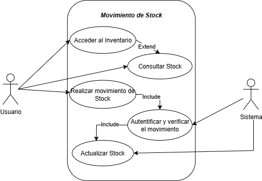
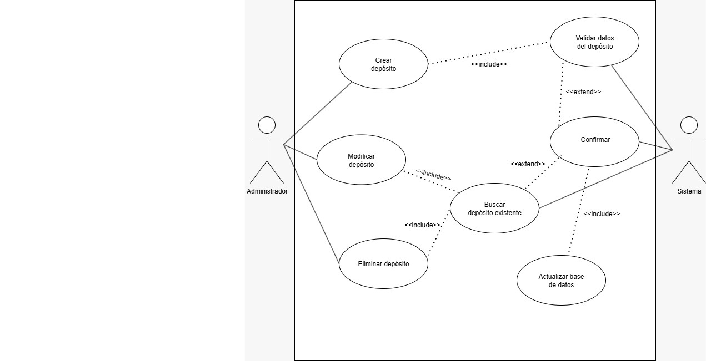
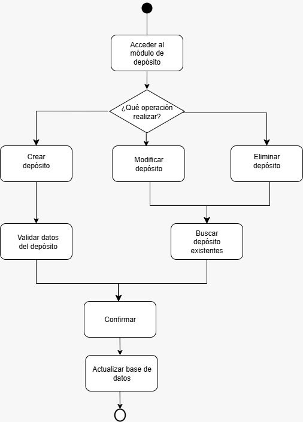
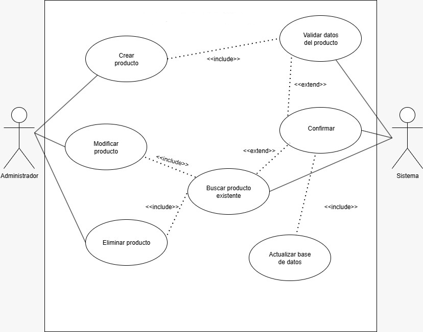
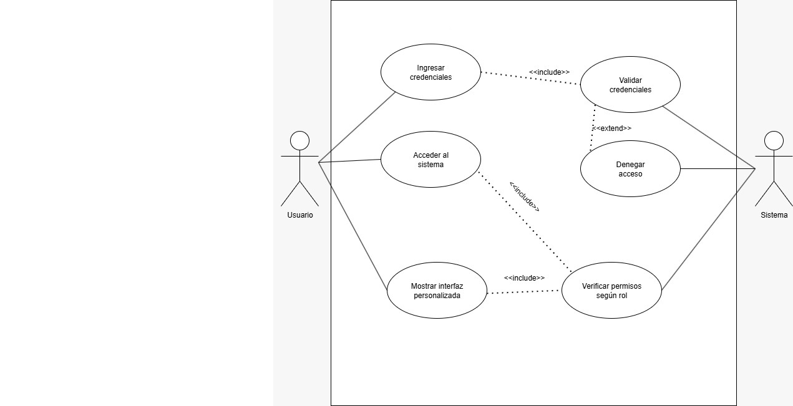
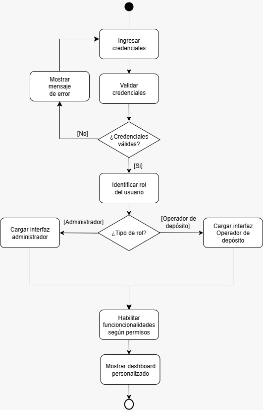
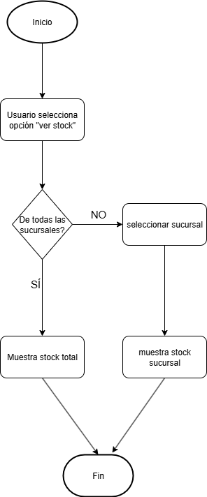
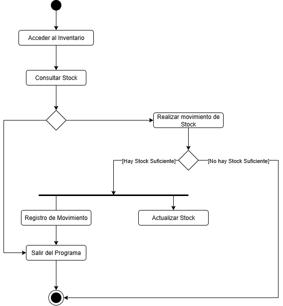

# Reporte primer / segunda semana

## Índice
1. [Reunión inicial y establecimiento de objetivos](#reunión-inicial-y-establecimiento-de-objetivos)
2. [Creación y clonación del repositorio](#creación-y-clonación-del-repositorio)
3. [Distribución del trabajo y asignación de tareas](#distribución-del-trabajo-y-asignación-de-tareas)
4. [Desarrollo de casos de uso](#desarrollo-de-casos-de-uso)
    - [Diagrama General](#diagrama-general)
    - [ABM de Depósitos](#abm-de-depósitos)
    - [ABM de Productos](#abm-de-productos)
    - [Sistema de Login](#login)
    - [Ver Stock](#ver-stock)
6. [Documentación y dificultades iniciales](#documentación-y-dificultades-iniciales)
7. [Configuración técnica y base de datos](#configuración-técnica-y-base-de-datos)
8. [Resultados alcanzados](#resultados-alcanzados)

---

## Reunión inicial y establecimiento de objetivos

Durante esta primera / segunda semana (debido a paro docente), como grupo de trabajo, llevamos a cabo una reunión inicial con el objetivo de sentar las bases del proyecto. En este encuentro establecimos los objetivos, revisamos los requerimientos y metas a corto plazo.

## Creación y clonación del repositorio

Uno de los primeros pasos fue la creación y clonación del repositorio, repasamos los requerimientos del proyecto y charlamos sobre lo que esperamos lograr en las próximas semanas.

## Distribución del trabajo y asignación de tareas

Proseguimos distribuyendo parte del trabajo entre todos los integrantes, asignándonos las primeras tareas / hitos de la semana.

## Desarrollo de casos de uso

Para los casos de uso, cada integrante asumió la responsabilidad sobre una parte, la comunicación se mantuvo constante ante las dudas y consultas de nuestros compañeros, con la intención de realizarlo en paralelo, para así avanzar más rápido y en conjunto.

También nos repartimos los diagramas que hay que entregar. Cada uno se hizo cargo de una parte, pero estuvimos consultando nuestras dudas y revisando el avance del trabajo, para asegurarnos de que todo esté bien relacionado.

### Diagrama General



### ABM de Depósitos




### ABM de Productos



### Login



### Ver stock



## Documentación y dificultades iniciales

La documentación se realizó en última instancia para dejar constancia de cada dificultad del grupo en nuestro inicio, el primer obstáculo fue el uso de GitHub, ya que varios integrantes no estaban familiarizados con esta herramienta.

## Configuración técnica y base de datos

Por último, se crearon los archivos de configuración necesarios para poder ejecutar la base de datos. Así como también, se crearon los modelos ORM con sus debidos campos y relaciones, se configuró todo lo necesario para poder ejecutar Alembic, y se realizó la migración con éxito.

## Resultados alcanzados

Logramos crear la base de datos correctamente, pudiendo ejecutar la prueba de script para agregar un primer producto, consiguiendo modificar la base de datos exitosamente. Utilizamos SQL lite, SQL Alchemy y Alembic.

### Test de Script

El script se puede probar desde el directorio principal ejecutando los siguientes comandos. 

```bash
git clone <url-del-repo>

cd backend #Moverse a directorio "backend"
python -m venv venv #Inicializo el entorno
source venv/bin/activate #Activo entorno (LINUX / MACOS)
venv/Scripts/activate.bat #Activo entorno (Windows)
pip install -r app/requirements.txt # Instalar los requerimientos
alembic revision --autogenerate -m "initial_migration" #Inicio migración inicial
alembic upgrade head #Actualizo el archivo para la creación de tablas


python -m app.console.script.insertar_producto # Ejecutar script
```

Una vez ejecutado podremos ver el resultado usando DB Browser o alguna interfaz para bases de datos.