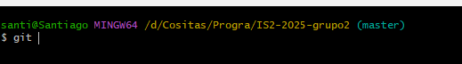
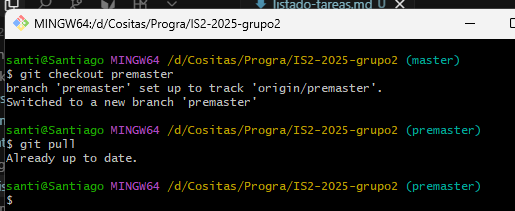

# Detalle de tareas semana 1
- [Descripción](#descripción)
- [Criterios de aceptación](#criterios)
  - [Preparar el entorno](#entorno)
- [Almacenamiento de datos](#almacenamiento-de-datos)
- [Referencias](#referencias)

# Descripción

En esta primer semana se buscará definir las tareas y estructuras sobre las que se trabajará el proyecto. 

# Criterios

El objetivo de esta primer semana es que cada participante del equipo pueda clonar el repositorio, preparar el entorno de desarrollo, practicar los comandos básicos de Git y realizar un análisis inicial del problema. 

## Entorno

Lo primero que necesitaremos será tener Git Bash descargado. En caso de no tenerlo podemos hacerlo, haciendo click [aquí](https://git-scm.com/downloads)

Una vez lo tenemos instalado, procederemos a abrir Git bash dentro del directorio donde querramos clonar el repositorio y lo hacemos así.

```bash
git clone https://github.com/Santicue14/IS2-2025-grupo2 (Shift + Insert para pegar)

```

Veremos que estamos trabajando sobre la rama **master**



Sobre esta ruta **NO** debemos trabajar, ya que se utiliza solamente para desplegar la versiones del proyecto que compilen y sean entregables finales.

Para cambiarnos de rama donde vamos a ir trabajando para luego dejar todo en master, será la rama premaster.

> [!CAUTION]
> Dentro de esta rama, nosotros lo que vamos a hacer **SIEMPRE** antes de trabajar en algún hito nuevo, serán traernos los últimos cambios, para esto tenemos que hacer lo siguiente.


```bash
git checkout premaster
git pull
```



Una vez que sabemos que estamos al día con los últimos cambios, recién ahí vamos a poder trabajar en un nuevo hito. Estos van a estar cargados en el sector projects dentro del mismo repositorio de github, o podemos acceder haciendo click [acá](https://github.com/users/Santicue14/projects/3).

Se va a a intentar que las ramas sobre las que vayamos trabajando sean lo más claras posibles. Por eso tratemos de mantener este formato "002-ABM_Productos"

Donde el 002 sería el número o ID del hito, y luego una descripción corta de lo que se hará.

Para crear estas ramas, lo que haremos va a ser (previamente parados sobre *premaster* y habiendo traído los cambios).

```bash
git checkout -b "XX-descripcion_del_hito"
```

Esto lo que va a hacer va a ser crearnos la rama con los últimos cambios que se hayan realizado.

> [!WARNING]
> Es importante que una vez que ya estemos parados y listos para trabajar sobre un hito, le cambiemos el estado al mismo dentro del proyecto para una mejor trazabilidad.

Acá adentro, trabajaremos normal sobre el hito. Y una vez que lo tengamos listo para subir, lo que haremos, en este caso tomamos de ejemplo una rama donde el nombre sea *002-ABM_Productos*.

```bash
git add . (para agregar todo)
git commit -m "semXX: mini descripción de lo realizado" (semXX será reemplazado por la semana en la que se lo haya realizado)
git push origin 002-ABM_Productos (cambiar por el nombre de la rama de ustedes)
```

Esto automáticamente va a crear una nueva rama dentro de GitHub, y lo que vamos a tener que hacer es solicitar un Pull Request sobre la rama ***PREMASTER***, es muy importante que hagamos los PR sobre la rama premaster para no pisar los cambios de la app que ya estén aprobados y testeados.

¿Cómo hacemos esto? 
Bueno en GitHub tenemos el sector pull requests, donde se solicitan las combinaciones de ramas y después, el líder del equipo las tendrá que aprobar o mismo revisar con los compañeros para verificar que todo esté correcto. Una vez lo corrijamos entre todos, recién ahí se mergean a la rama premaster para luego pasar a la rama master.


